# ⚡ Cloud Function SaaS

<div align="center">

[](https://opensource.org/licenses/Apache-2.0)
[](https://www.python.org/downloads/)
[](https://cloud.google.com/run)
[](https://www.anthropic.com/claude)

*Transform specification documents into deployed Google Cloud Run microservices with AI*

[Quick Start](#quick-start) • [Examples](examples/) • [Documentation](future/goals.md) • [Contributing](future/CONTRIBUTING.md)

</div>

---

## 🚀 What is Cloud Function SaaS?

Cloud Function SaaS is an AI-powered tool that converts simple markdown specifications into fully deployed Google Cloud Run microservices. Write your API specification in plain English, and let Claude AI generate and deploy production-ready code.

### ✨ Key Features

- 📝 **Simple Specs**: Write APIs in markdown format
- 🤖 **AI-Powered**: Claude AI generates production-ready code
- ☁️ **Auto-Deploy**: Direct deployment to Google Cloud Run
- 🔧 **Multi-Language**: Support for Node.js, Python, Go (planned)
- ✅ **Validation**: Comprehensive setup and spec validation
- 📊 **Verbose Logging**: Detailed deployment feedback

## 🚀 Quick Start

### Prerequisites

Before you begin, ensure you have:

- **Python 3.8+** installed
- **Google Cloud SDK** ([Installation Guide](https://cloud.google.com/sdk/docs/install))
- **Anthropic API key** ([Get yours here](https://console.anthropic.com/))
- **Google Cloud project** with Cloud Run enabled

### Installation

1. **Clone the repository**
   ```bash
   git clone https://github.com/yourusername/cloud-function-saas.git
   cd cloud-function-saas
   ```

2. **Install dependencies**
   ```bash
   pip install -r requirements.txt
   ```

3. **Configure Google Cloud**
   ```bash
   gcloud auth login
   gcloud config set project your-gcp-project-id
   ```

4. **Set up environment variables**
   ```bash
   # Create .env file with your credentials
   echo "ANTHROPIC_API_KEY=your_api_key_here" > .env
   echo "GOOGLE_CLOUD_PROJECT=your-gcp-project-id" >> .env
   ```

### Your First Deployment

1. **Validate your setup**
   ```bash
   python prototype.py examples/example-spec.md --validate-only
   ```

2. **Deploy the example service**
   ```bash
   python prototype.py examples/example-spec.md --verbose
   ```

3. **Test your deployed service**
   ```bash
   curl https://your-service-url.run.app/users
   ```

🎉 **That's it!** Your microservice is now live on Google Cloud Run.

## 📋 Writing Specifications

Cloud Function SaaS uses a simple, intuitive markdown format that Claude AI can understand and transform into code.

### Basic Spec Structure

```markdown
# Service Name: Your API Name
Description: What your service does
Runtime: Node.js 20

## Endpoints
### GET /resource
- Description: What this endpoint does
- Output: { expected: "response format" }

### POST /resource
- Description: Create new resource
- Input: { required: "input format" }
- Output: { created: "resource" }

## Models
### ResourceModel
- field1: string (required)
- field2: number (optional)
- createdAt: timestamp
```

### 🎯 Example Specifications

| Service Type | Example | Description |
|-------------|---------|-------------|
| **User Management** | [`examples/user-api-nodejs.spec.md`](examples/user-api-nodejs.spec.md) | CRUD operations for users |
| **Authentication** | [`examples/auth-service-go.spec.md`](examples/auth-service-go.spec.md) | JWT-based auth service |
| **Data Processing** | [`examples/data-processor-python.spec.md`](examples/data-processor-python.spec.md) | Async data pipeline |
| **Webhooks** | [`examples/webhook-handler-nodejs.spec.md`](examples/webhook-handler-nodejs.spec.md) | Event processing |

> 💡 **Tip**: Start with the [basic example](examples/example-spec.md) and modify it for your needs.

## ⚙️ Configuration

### Environment Variables

Create a `.env` file in your project root:

```env
# Required
ANTHROPIC_API_KEY=your_claude_api_key
GOOGLE_CLOUD_PROJECT=your-gcp-project-id

# Optional (with defaults)
CLAUDE_MODEL=                    # Auto-detects latest Sonnet
CLAUDE_MAX_TOKENS=4000
CLAUDE_TEMPERATURE=0.1
GOOGLE_CLOUD_REGION=us-central1
```

### Command Line Options

```bash
python prototype.py <spec-file> [options]
```

| Option | Description | Example |
|--------|-------------|---------|
| `--project` | Override GCP project | `--project my-project` |
| `--region` | Override deployment region | `--region europe-west1` |
| `--output-dir` | Keep generated files | `--output-dir ./generated` |
| `--validate-only` | Check setup without deploying | `--validate-only` |
| `--verbose, -v` | Detailed output | `--verbose` |

### Usage Examples

```bash
# Basic deployment
python prototype.py my-spec.md

# Detailed output with file preservation
python prototype.py my-spec.md --verbose --output-dir ./generated

# Validation only
python prototype.py my-spec.md --validate-only

# Custom project and region
python prototype.py my-spec.md --project my-project --region europe-west1
```

## 🔧 How It Works

```mermaid
graph LR
    A[📝 Spec File] --> B[🔍 Parse]
    B --> C[🤖 Claude AI]
    C --> D[📦 Generate Code]
    D --> E[☁️ Deploy to Cloud Run]
    E --> F[🌐 Live Service URL]
```



1. **📋 Parse** - Extract structure from your markdown spec
2. **🤖 Generate** - Claude AI creates production-ready code
3. **☁️ Deploy** - Automatic deployment to Google Cloud Run
4. **✅ Validate** - Comprehensive checks at every step

## 🛡️ Validation & Error Handling

Cloud Function SaaS includes robust validation:

| Check | Description | Status |
|-------|-------------|--------|
| 🔑 **API Keys** | Validates Anthropic API access | ✅ |
| ☁️ **GCP Setup** | Checks `gcloud` auth and permissions | ✅ |
| 📋 **Spec Format** | Validates specification syntax | ✅ |
| 🚀 **Cloud Run** | Verifies service deployment | ✅ |

> 💡 Use `--validate-only` to check your setup without deploying

## 📁 Project Structure

```
cloud-function-saas/
├── 📋 README.md                 # You are here
├── 🐍 prototype.py             # Main CLI tool
├── 📦 requirements.txt         # Python dependencies
├── 🔧 src/                     # Core modules
│   ├── core/                   # Parser & generator
│   └── providers/              # Cloud providers
├── 📚 examples/                # Example specifications
│   ├── user-api-nodejs.spec.md
│   ├── auth-service-go.spec.md
│   └── data-processor-python.spec.md
└── 🚀 generated/               # Generated deployments
```

## 🤝 Contributing

We welcome contributions! Please see our [Contributing Guide](future/CONTRIBUTING.md) for details.

### Development Setup

```bash
git clone https://github.com/yourusername/cloud-function-saas.git
cd cloud-function-saas
pip install -r requirements.txt
python -m pytest tests/
```

## 📄 License

This project is licensed under the Apache License 2.0 - see the [LICENSE](LICENSE) file for details.

## 🌟 Support

- 📖 **Documentation**: [Project Goals & Roadmap](future/goals.md)
- 🐛 **Issues**: [GitHub Issues](https://github.com/yourusername/cloud-function-saas/issues)
- 💬 **Discussions**: [GitHub Discussions](https://github.com/yourusername/cloud-function-saas/discussions)

---

<div align="center">

**Made with ❤️ and AI**

[⭐ Star this repo](https://github.com/yourusername/cloud-function-saas) • [🍴 Fork it](https://github.com/yourusername/cloud-function-saas/fork) • [📢 Share it](https://twitter.com/intent/tweet?text=Check%20out%20Cloud%20Function%20SaaS!)

</div>