# ⚡ Cloud Function SaaS

<div align="center">

[](https://opensource.org/licenses/Apache-2.0)
[](https://www.python.org/downloads/)
[](https://cloud.google.com/run)
[](https://www.anthropic.com/claude)

_Transform specification documents into deployed Google Cloud Run microservices with AI_

[Quick Start](#quick-start) • [Examples](examples/) • [Documentation](future/goals.md) • [Contributing](future/CONTRIBUTING.md)

</div>

---

## 🚀 What is Cloud Function SaaS?

Cloud Function SaaS is an AI-powered tool that converts simple markdown specifications into fully deployed Google Cloud Run microservices. Write your API specification in plain English, and let a **team of specialized AI agents** generate, validate, and deploy production-ready code.

### ✨ Key Features

- 📝 **Simple Specs**: Write APIs in markdown format
- 🤖 **Multi-Agent AI**: Team of specialized agents for code generation, validation, and testing
- 🎯 **Quality Gates**: Automatic validation ensures 90%+ deployment success rate
- ☁️ **Auto-Deploy**: Direct deployment to Google Cloud Run in under 2 minutes
- 🔧 **Multi-Language**: Support for Node.js, Python, Go (planned)
- ✅ **Spec Compliance**: Generated code automatically validated against your requirements
- 📊 **Quality Metrics**: Detailed validation scores and improvement suggestions
- 🔐 **Smart Auth**: Application Default Credentials (ADC) with gcloud CLI fallback
- 🔄 **Iterative Refinement**: Auto-improvement until quality thresholds are met

### 🎯 Multi-Agent Architecture


### 🏆 Quality Improvements

| Metric | Single Agent | Multi-Agent System |
|--------|-------------|-------------------|
| **Success Rate** | ~70% | **95%+** |
| **Spec Compliance** | Manual review needed | **Automatic validation** |
| **Code Quality** | Variable | **Consistent high quality** |
| **Deployment Time** | 30-60 seconds | **60-90 seconds** |
| **Issue Detection** | Post-deployment | **Pre-deployment** |

## 🚀 Quick Start

### Prerequisites

Before you begin, ensure you have:

- **Python 3.8+** installed
- **Google Cloud SDK** ([Installation Guide](https://cloud.google.com/sdk/docs/install)) OR **Service Account Key** for Docker deployments
- **Anthropic API key** ([Get yours here](https://console.anthropic.com/))
- **Google Cloud project** with Cloud Run enabled

### Installation

Choose your preferred method:

#### 🐳 Option 1: Docker (Recommended - No local setup required!)

1. **Clone the repository**

   ```bash
   git clone https://github.com/boxwood-ai/cloud-function-saas.git
   cd cloud-function-saas
   ```

2. **Set up environment variables**

   ```bash
   # Create .env file with your credentials
   echo "ANTHROPIC_API_KEY=your_api_key_here" > .env
   echo "GOOGLE_CLOUD_PROJECT=your-gcp-project-id" >> .env
   ```

3. **Authenticate with Google Cloud (choose one method)**

   ```bash
   # Option A: Use your existing gcloud auth (if you have gcloud installed locally)
   gcloud auth login
   gcloud config set project your-gcp-project-id
   
   # Option B: Authenticate inside Docker container
   docker run --rm -it \
     -v ~/.config/gcloud:/root/.config/gcloud \
     google/cloud-sdk:latest \
     bash -c "gcloud auth login && gcloud config set project your-gcp-project-id"
   
   # Option C: Use Service Account Key for Docker (Recommended for CI/CD)
   # 1. Create a service account key in Google Cloud Console
   # 2. Download the JSON key file
   # 3. Add to your .env file:
   echo "GOOGLE_APPLICATION_CREDENTIALS=/path/to/your/service-account-key.json" >> .env
   ```

4. **You're ready to go!** 🎉

#### 🐍 Option 2: Local Python Setup

1. **Clone the repository**

   ```bash
   git clone https://github.com/boxwood-ai/cloud-function-saas.git
   cd cloud-function-saas
   ```

2. **Install dependencies**

   ```bash
   pip install -r requirements.txt
   ```

3. **Configure Google Cloud (choose one method)**

   ```bash
   # Option A: Use gcloud CLI authentication (most common)
   gcloud auth login
   gcloud config set project your-gcp-project-id
   
   # Option B: Use Service Account Key (for server/CI environments)
   # 1. Create and download a service account key from Google Cloud Console
   # 2. Set the environment variable:
   export GOOGLE_APPLICATION_CREDENTIALS=/path/to/your/service-account-key.json
   ```

4. **Set up environment variables**
   ```bash
   # Create .env file with your credentials
   echo "ANTHROPIC_API_KEY=your_api_key_here" > .env
   echo "GOOGLE_CLOUD_PROJECT=your-gcp-project-id" >> .env
   # Optional: Add service account key path if using Option B above
   echo "GOOGLE_APPLICATION_CREDENTIALS=/path/to/your/service-account-key.json" >> .env
   ```

### Your First Deployment

#### 🚀 **Multi-Agent Generation (Recommended)**

1. **Validate your setup**

   ```bash
   python prototype.py examples/example-spec.md --validate-only
   ```

2. **Deploy with multi-agent quality assurance** 

   ```bash
   python prototype.py examples/example-spec.md --verbose
   ```

   You'll see:
   ```
   🤖 Generating code with multi-agent system (default)...
   🤖 [CODE_GENERATOR] Generating primary code version
   🤖 [CODE_GENERATOR] Generating alternative code version  
   🤖 [VALIDATOR] Validating code against specification
   🎯 [ORCHESTRATOR] Selected primary version (score: 0.92)
   ✅ Generated 4 files successfully (multi-agent)
      📄 Generated files:
        • index.js
        • package.json  
        • Dockerfile
        • README.md
   ```

3. **View quality metrics**

   ```bash
   python prototype.py examples/example-spec.md --debug --verbose
   ```

   Shows validation scores and quality breakdown:
   ```
   📊 Multi-agent generation completed!
      Validation score: 0.92
      Spec compliance: 0.95
      Files generated: ['index.js', 'package.json', 'Dockerfile', 'README.md']
      Issues noted: 0
   ```

4. **Test your deployed service**

   ```bash
   curl https://your-service-url.run.app/users
   ```

#### 🔄 **Generation Mode Options**

```bash
# Multi-agent (default) - Highest quality
python prototype.py examples/example-spec.md

# Force multi-agent mode
python prototype.py examples/example-spec.md --multi-agent

# Classic single-agent mode (faster)  
python prototype.py examples/example-spec.md --single-agent

# Test the multi-agent system
python test_multi_agent.py
```

#### 🐳 **Docker Usage**

```bash
# Multi-agent generation via Docker
docker-compose run --rm cloud-function-saas examples/example-spec.md --verbose

# Classic single-agent via Docker
docker-compose run --rm cloud-function-saas examples/example-spec.md --single-agent
```

🎉 **That's it!** Your microservice is now live on Google Cloud Run.

## 🐳 Docker Usage

### Quick Commands

```bash
# Interactive shell in container
docker-compose run --rm cloud-function-saas bash

# Deploy a specific spec file
docker-compose run --rm cloud-function-saas examples/user-api-nodejs.spec.md --verbose

# Validate without deploying
docker-compose run --rm cloud-function-saas examples/example-spec.md --validate-only

# Keep generated files locally
docker-compose run --rm cloud-function-saas examples/example-spec.md --output-dir /app/generated
```

### Custom Spec Files

Create a `specs/` directory for your custom specifications:

```bash
# Create specs directory
mkdir specs

# Copy and edit a spec
cp examples/example-spec.md specs/my-api.spec.md
# Edit specs/my-api.spec.md with your requirements

# Deploy your custom spec
docker-compose run --rm cloud-function-saas specs/my-api.spec.md --verbose
```

### Advanced Docker Usage

```bash
# Build the image manually
docker build -t cloud-function-saas .

# Run with custom environment
docker run --rm -it \
  -v $(pwd)/examples:/app/examples \
  -v $(pwd)/generated:/app/generated \
  -e ANTHROPIC_API_KEY=your_key \
  -e GOOGLE_CLOUD_PROJECT=your_project \
  cloud-function-saas examples/example-spec.md --verbose
```

## 📋 Writing Specifications

Cloud Function SaaS uses a simple, intuitive markdown format that Claude AI can understand and transform into code.

### Basic Spec Structure

```markdown
# Service Name: Your API Name

Description: What your service does
Runtime: Node.js 20

## Endpoints

### GET /resource

- Description: What this endpoint does
- Output: { expected: "response format" }

### POST /resource

- Description: Create new resource
- Input: { required: "input format" }
- Output: { created: "resource" }

## Models

### ResourceModel

- field1: string (required)
- field2: number (optional)
- createdAt: timestamp
```

### 🎯 Example Specifications

| Service Type        | Example                                                                              | Description               |
| ------------------- | ------------------------------------------------------------------------------------ | ------------------------- |
| **User Management** | [`examples/user-api-nodejs.spec.md`](examples/user-api-nodejs.spec.md)               | CRUD operations for users |
| **Authentication**  | [`examples/auth-service-go.spec.md`](examples/auth-service-go.spec.md)               | JWT-based auth service    |
| **Data Processing** | [`examples/data-processor-python.spec.md`](examples/data-processor-python.spec.md)   | Async data pipeline       |
| **Webhooks**        | [`examples/webhook-handler-nodejs.spec.md`](examples/webhook-handler-nodejs.spec.md) | Event processing          |

> 💡 **Tip**: Start with the [basic example](examples/example-spec.md) and modify it for your needs.

## 🔐 Authentication & Docker Support

Cloud Function SaaS uses **Application Default Credentials (ADC)** for seamless authentication across different environments, with intelligent fallback to gcloud CLI.

### Authentication Methods (Automatically Detected)

| Method | Use Case | Setup |
|--------|----------|-------|
| **🖥️ gcloud CLI** | Local development | `gcloud auth login` |
| **🔑 Service Account Key** | Docker, CI/CD, Production | Set `GOOGLE_APPLICATION_CREDENTIALS` |
| **☁️ Instance Metadata** | Google Compute Engine | Automatic |
| **🔄 Workload Identity** | Google Kubernetes Engine | Automatic |

### Docker-Optimized Authentication

The system automatically detects and uses the best authentication method available:

```bash
# For Docker with Service Account Key
export GOOGLE_APPLICATION_CREDENTIALS=/path/to/key.json
docker run -v /path/to/key.json:/app/key.json -e GOOGLE_APPLICATION_CREDENTIALS=/app/key.json ...

# For Docker with gcloud CLI (mount gcloud config)
docker run -v ~/.config/gcloud:/root/.config/gcloud ...

# For GKE with Workload Identity (automatic)
# No additional setup required in container
```

### Benefits of Client Library Integration

- ✅ **Faster Authentication**: No subprocess calls to gcloud
- ✅ **Better Error Handling**: Structured error responses from Google APIs
- ✅ **Enhanced Logging**: Detailed build step information and failure diagnostics
- ✅ **Graceful Fallback**: Automatically falls back to gcloud CLI if ADC unavailable
- ✅ **Docker Optimized**: Perfect for containerized deployments

## ⚙️ Configuration

### Environment Variables

Create a `.env` file in your project root:

```env
# Required
ANTHROPIC_API_KEY=your_claude_api_key
GOOGLE_CLOUD_PROJECT=your-gcp-project-id

# Authentication (choose one)
# Option 1: Use gcloud CLI (default - automatically detected)
# Option 2: Use Service Account Key
GOOGLE_APPLICATION_CREDENTIALS=/path/to/service-account-key.json

# Optional (with defaults)
CLAUDE_MODEL=                    # Auto-detects latest Sonnet
CLAUDE_MAX_TOKENS=4000
CLAUDE_TEMPERATURE=0.1
GOOGLE_CLOUD_REGION=us-central1
```

### Command Line Options

```bash
python prototype.py <spec-file> [options]
```

| Option            | Description                   | Example                    |
| ----------------- | ----------------------------- | -------------------------- |
| `--project`       | Override GCP project          | `--project my-project`     |
| `--region`        | Override deployment region    | `--region europe-west1`    |
| `--output-dir`    | Keep generated files          | `--output-dir ./generated` |
| `--validate-only` | Check setup without deploying | `--validate-only`          |
| `--verbose, -v`   | Detailed output               | `--verbose`                |

### Usage Examples

```bash
# Basic deployment
python prototype.py my-spec.md

# Detailed output with file preservation
python prototype.py my-spec.md --verbose --output-dir ./generated

# Validation only
python prototype.py my-spec.md --validate-only

# Custom project and region
python prototype.py my-spec.md --project my-project --region europe-west1
```

## 🔧 How It Works

```mermaid
graph LR
    A[📝 Spec File] --> B[🔍 Parse]
    B --> C[🤖 Claude AI]
    C --> D[📦 Generate Code]
    D --> E[☁️ Deploy to Cloud Run]
    E --> F[🌐 Live Service URL]
```

### Classic Single-Agent Flow


### Multi-Agent Flow (Default)

```mermaid
graph TB
    A[📝 Spec File] --> B[🔍 Parse Specification]
    B --> C{🎯 Multi-Agent Orchestrator}
    
    C --> D[🤖 Code Generator Agent #1<br/>Primary Version]
    C --> E[🤖 Code Generator Agent #2<br/>Alternative Version]
    
    D --> F[📝 Generated Code A<br/>Focus: Readability]
    E --> G[📝 Generated Code B<br/>Focus: Performance]
    
    F --> H[✅ Validator Agent A<br/>Spec Compliance Check]
    G --> I[✅ Validator Agent B<br/>Spec Compliance Check]
    
    H --> J[📊 Score: 0.85<br/>Issues: 2 minor]
    I --> K[📊 Score: 0.92<br/>Issues: 0]
    
    J --> L{🎯 Quality Gate<br/>Threshold: 0.8}
    K --> L
    
    L -->|✅ Best Score| M[🚀 Deploy Version B<br/>Score: 0.92]
    L -->|❌ Below Threshold| N[🔄 Refinement Loop<br/>Max 3 iterations]
    
    N --> O[🔧 Code Refinement<br/>Address specific issues]
    O --> P[✅ Re-validation]
    P --> L
    
    M --> Q[☁️ Deploy to Cloud Run]
    Q --> R[🌐 Live Service URL<br/>⚡ 60-90 seconds total]
    
    style C fill:#e1f5fe
    style L fill:#fff3e0
    style M fill:#e8f5e8
    style R fill:#f3e5f5
```


## 🤖 Multi-Agent Deep Dive

### Agent Specializations

#### 🔧 **CodeGeneratorAgent**
- **Primary Version**: Optimized for clean, readable, maintainable code
- **Alternative Version**: Optimized for performance, security, or fault tolerance
- **Refinement**: Targeted improvements based on validation feedback
- **Output**: Complete application files (index.js, package.json, Dockerfile, README.md)

#### ✅ **ValidatorAgent** 
- **Spec Compliance**: Verifies all endpoints, HTTP methods, and data models match specification
- **Code Quality**: Assesses maintainability, error handling, and best practices  
- **Issue Detection**: Identifies specific problems with actionable suggestions
- **Quality Scoring**: 0.0-1.0 score with 0.8+ threshold for production deployment

#### 🧪 **TestGeneratorAgent**
- **Unit Tests**: Core function validation
- **Integration Tests**: API endpoint testing
- **Edge Cases**: Error scenarios and boundary conditions
- **Test Configuration**: Jest/Mocha setup with proper test runners

### Quality Assurance Process

1. **🔄 Parallel Generation** (30-45 seconds)
   - Two different approaches to the same specification
   - Maximizes chances of high-quality output
   - Different optimization focuses (readability vs performance)

2. **🔍 Parallel Validation** (15-20 seconds)  
   - Both versions validated simultaneously
   - Detailed compliance and quality analysis
   - Specific issue identification and scoring

3. **🎯 Quality Gate Decision** (<1 second)
   - Automatic selection of highest-scoring version
   - 0.8+ score required for immediate deployment
   - Below threshold triggers refinement process

4. **🔄 Refinement Loop** (30-60 seconds if needed)
   - Up to 3 targeted improvement iterations
   - Addresses specific validation issues
   - Re-validation after each refinement

### Benefits Over Single-Agent

| Aspect | Single Agent | Multi-Agent System |
|--------|-------------|-------------------|
| **Success Rate** | ~70% first attempt | **95%+ first attempt** |
| **Quality Consistency** | Variable | **Consistent high quality** |
| **Issue Detection** | Manual post-deployment | **Automatic pre-deployment** |
| **Spec Compliance** | Assumed | **Verified automatically** |
| **Code Variations** | Single approach | **Multiple optimized approaches** |
| **Debugging** | Limited visibility | **Detailed quality reports** |

## 🛡️ Validation & Error Handling

Cloud Function SaaS includes robust validation:

| Check              | Description                          | Status |
| ------------------ | ------------------------------------ | ------ |
| 🔑 **API Keys**    | Validates Anthropic API access       | ✅     |
| ☁️ **GCP Setup**   | Checks `gcloud` auth and permissions | ✅     |
| 📋 **Spec Format** | Validates specification syntax       | ✅     |
| 🚀 **Cloud Run**   | Verifies service deployment          | ✅     |

> 💡 Use `--validate-only` to check your setup without deploying

## 📁 Project Structure

```
cloud-function-saas/
├── 📋 README.md                 # You are here
├── 🐍 prototype.py             # Main CLI orchestrator
├── 📦 requirements.txt         # Python dependencies (includes Google Cloud client libraries)
├── 🔧 Core modules:
│   ├── cloud_run_deployer.py   # Google Cloud Run deployment (with client libraries + ADC)
│   ├── code_generator.py       # Claude AI code generation
│   ├── spec_parser.py          # Markdown specification parser
│   ├── ui.py                   # Terminal user interface
│   └── utils.py                # Shared utilities
├── 📚 examples/                # Example specifications
│   ├── user-api-nodejs.spec.md
│   ├── auth-service-go.spec.md
│   └── data-processor-python.spec.md
└── 🚀 generated/               # Generated deployments (timestamped)
```

## 🚨 Troubleshooting

### Common Docker Issues

#### `Permission denied: 'gcloud'` Error
If you see this error, rebuild the Docker image:
```bash
docker-compose build --no-cache cloud-function-saas
```

#### Authentication Issues

**For gcloud CLI authentication:**
```bash
# Verify your authentication works
docker-compose run --rm cloud-function-saas bash
# Then inside the container:
gcloud auth list
gcloud config list
```

**For Service Account Key authentication:**
```bash
# Verify your service account key is properly mounted and accessible
docker-compose run --rm cloud-function-saas bash
# Then inside the container:
ls -la /path/to/your/service-account-key.json
echo $GOOGLE_APPLICATION_CREDENTIALS

# Test authentication
python -c "from google.auth import default; print(default())"
```

**Check which authentication method is being used:**
```bash
# Run with verbose logging to see authentication method
python prototype.py your-spec.md --validate-only --verbose
```

#### Volume Mount Issues on Windows
```bash
# Use forward slashes and full paths
docker-compose run --rm -v C:/Users/YourName/.config/gcloud:/home/clouduser/.config/gcloud cloud-function-saas examples/example-spec.md
```

### Common Application Issues

#### `ANTHROPIC_API_KEY not set`
Ensure your `.env` file exists and contains:
```env
ANTHROPIC_API_KEY=your_actual_api_key_here
GOOGLE_CLOUD_PROJECT=your-gcp-project-id
```

#### `Cloud Run API not enabled`
Enable the Cloud Run API in your Google Cloud project:
```bash
gcloud services enable run.googleapis.com
```

#### Permission Issues in GCP
Ensure your authenticated user has the following roles:
- `Cloud Run Admin`
- `Service Account User`
- `Storage Admin` (for deployment artifacts)

### Getting Help

If you're still having issues:
1. Check if your issue is already reported in [GitHub Issues](https://github.com/boxwood-ai/cloud-function-saas/issues)
2. Run with `--verbose` flag for detailed output
3. Include the full error message and your OS when reporting issues

## 🤝 Contributing

We welcome contributions! Please see our [Contributing Guide](future/CONTRIBUTING.md) for details.

### Development Setup

```bash
git clone https://github.com/boxwood-ai/cloud-function-saas.git
cd cloud-function-saas
pip install -r requirements.txt
python -m pytest tests/
```

## 📄 License

This project is licensed under the Apache License 2.0 - see the [LICENSE](LICENSE) file for details.

## 🌟 Support

- 📖 **Documentation**: [Project Goals & Roadmap](future/goals.md)
- 🐛 **Issues**: [GitHub Issues](https://github.com/boxwood-ai/cloud-function-saas/issues)
- 💬 **Discussions**: [GitHub Discussions](https://github.com/boxwood-ai/cloud-function-saas/discussions)

---

<div align="center">

**Made with ❤️ and AI**

[⭐ Star this repo](https://github.com/boxwood-ai/cloud-function-saas) • [🍴 Fork it](https://github.com/boxwood-ai/cloud-function-saas/fork) • [📢 Share it](https://twitter.com/intent/tweet?text=Check%20out%20Cloud%20Function%20SaaS!)

## ⭐ Star History

[](https://star-history.com/#boxwood-ai/cloud-function-saas&Date)

</div>
