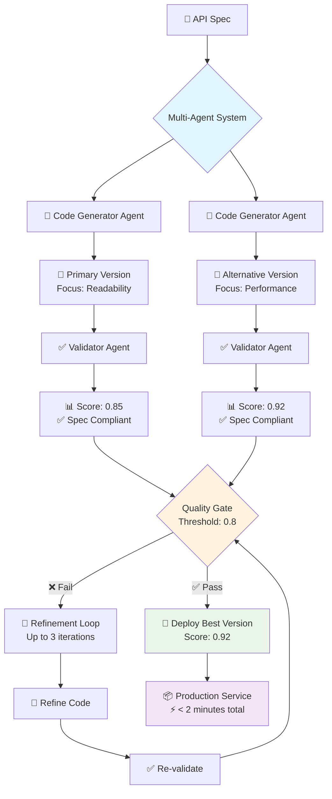

# 📚 Cloud Function SaaS Documentation

Welcome to the comprehensive documentation for Cloud Function SaaS - an AI-powered tool for transforming specification documents into deployed Google Cloud Run microservices.

## 🚀 Getting Started

- **[Main README](../README.md)** - Quick start guide and overview
- **[Writing Specifications](specifications.md)** - How to write effective service specifications
- **[Troubleshooting](troubleshooting.md)** - Common issues and solutions

## 🤖 AI System

- **[Multi-Agent System Guide](multi-agent-system.md)** - Deep dive into the multi-agent architecture
- **[Project Goals & Vision](goals.md)** - Project roadmap and technical vision

## 🤝 Contributing

- **[Contributing Guide](contributing.md)** - How to contribute to the project
- **[Development Setup](contributing.md#development-setup)** - Local development environment

## 📖 Documentation Structure

### Core Documentation

- **README.md** (main) - Quick start and overview
- **specifications.md** - Writing effective API specifications
- **multi-agent-system.md** - AI system architecture and usage
- **troubleshooting.md** - Common issues and debugging

### Project Information

- **goals.md** - Project vision and technical architecture
- **contributing.md** - Contribution guidelines and development setup

## 🎯 Quick Navigation

### I want to...

**Get started quickly**
→ [Main README](../README.md#quick-start)

**Write my first specification**
→ [Writing Specifications](specifications.md#basic-spec-structure)

**Use Docker**
→ Docker Usage Guide (coming soon!)

**Understand the multi-agent system**
→ [Multi-Agent System Guide](multi-agent-system.md#overview)

**Fix an issue**
→ [Troubleshooting Guide](troubleshooting.md)

**Contribute to the project**
→ [Contributing Guide](contributing.md)

**See what's planned**
→ Feature Roadmap

## 📋 Example Specifications

Check out the [examples/](../examples/) directory for sample specifications:

- **[Simple User API](../examples/user-api-nodejs.spec.md)** - Basic CRUD operations
- **[Authentication Service](../examples/auth-service-go.spec.md)** - JWT-based authentication
- **[Data Processing Pipeline](../examples/data-processor-python.spec.md)** - Asynchronous processing
- **[Webhook Handler](../examples/webhook-handler-nodejs.spec.md)** - Event processing

## 🔧 Configuration Reference

### Environment Variables

```bash
# Required
ANTHROPIC_API_KEY=your_claude_api_key
GOOGLE_CLOUD_PROJECT=your-gcp-project-id

# Optional
GOOGLE_APPLICATION_CREDENTIALS=/path/to/service-account-key.json
GOOGLE_CLOUD_REGION=us-central1
CLAUDE_MODEL=claude-sonnet-4-20250514
CLAUDE_MAX_TOKENS=4000
CLAUDE_TEMPERATURE=0.1

# Multi-agent specific
MULTI_AGENT_QUALITY_THRESHOLD=0.8
MULTI_AGENT_MAX_ITERATIONS=3
MULTI_AGENT_ENABLE_FALLBACK=true
```

### Command Line Options

```bash
python prototype.py <spec-file> [options]

--project           Override GCP project
--region           Override deployment region
--output-dir       Keep generated files
--validate-only    Check setup without deploying
--verbose, -v      Detailed output
--debug            Enable debug logging
--multi-agent      Force multi-agent mode (default)
--single-agent     Use classic single-agent mode
```

## 🛡️ Security Considerations

- **API Keys**: Store securely in `.env` files, never commit to version control
- **Service Accounts**: Use principle of least privilege when creating service account keys
- **Authentication**: Use Google Cloud IAM and Application Default Credentials when possible
- **Generated Code**: Review generated code before deploying to production
- **Network Security**: Configure appropriate firewall rules and VPC settings

## 📊 Monitoring and Observability

Cloud Function SaaS automatically configures basic monitoring for deployed services:

- **Cloud Logging**: Application logs and request traces
- **Cloud Monitoring**: Basic metrics (requests, latency, errors)
- **Error Reporting**: Automatic error aggregation
- **Health Checks**: Built-in health endpoints

## 🔄 How It Works

### Multi-Agent Architecture Flow



### Deployment Lifecycle

1. **Specification** - Write your API specification in markdown
2. **Validation** - System validates spec format and requirements
3. **Generation** - Multi-agent system generates optimized code
4. **Quality Gates** - Automatic validation ensures spec compliance
5. **Build** - Google Cloud Build creates container image
6. **Deploy** - Service deployed to Google Cloud Run
7. **Health Check** - Automatic verification of service health

## 📈 Performance Characteristics

### Generation Times

- **Single Agent**: 30-45 seconds
- **Multi-Agent**: 60-90 seconds
- **With Refinement**: 90-150 seconds

### Success Rates

- **Single Agent**: ~70% first attempt
- **Multi-Agent**: ~90% first attempt
- **With Refinement**: ~95%+ success rate

### Resource Usage

- **Memory**: 512Mi default (configurable)
- **CPU**: 1000m default (configurable)
- **Cold Start**: ~2-3 seconds typical
- **Concurrent Requests**: 1000 default

## 🧪 Testing and Validation

The system includes multiple validation layers:

- **Spec Validation**: Markdown format and structure validation
- **Code Quality**: Multi-agent validation against specification
- **Build Validation**: Container image build verification
- **Deployment Validation**: Service deployment and health checks
- **Runtime Validation**: Basic functionality testing

## 🌐 Community and Support

- **GitHub Repository**: [boxwood-ai/cloud-function-saas](https://github.com/boxwood-ai/cloud-function-saas)
- **Issues**: Report bugs and request features via GitHub Issues
- **Discussions**: Community discussion via GitHub Discussions
- **Documentation**: This documentation site and README files
- **Examples**: Comprehensive examples in the `examples/` directory

---

**Need help?** Check the [Troubleshooting Guide](troubleshooting.md) or open an issue on GitHub.
