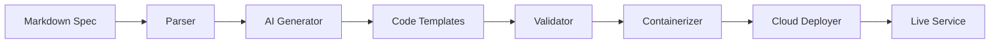

# 🚀 Cloud Function SaaS Generator

[](https://github.com/yourorg/cloud-function-saas/actions)
[](https://codecov.io/gh/yourorg/cloud-function-saas)
[](https://opensource.org/licenses/MIT)
[](https://www.python.org/downloads/)

Transform markdown specifications into production-ready cloud functions with AI-powered code generation.

## ✨ Features

- 🤖 **AI-Powered Generation**: Uses Claude/GPT to generate production-ready code
- ☁️ **Multi-Cloud Support**: Deploy to Google Cloud Run, AWS Lambda, Azure Functions
- 📝 **Simple Specs**: Define services in readable markdown format
- 🐳 **Container Ready**: Generates optimized Dockerfiles with security best practices
- 🔒 **Security First**: Built-in secret sanitization and secure deployment practices
- 🧪 **Testing Built-in**: Generates tests alongside your service code
- 📊 **Observability**: Includes logging, monitoring, and health checks

## 🚀 Quick Start

### Installation

```bash
# Install from PyPI
pip install cloud-function-saas

# Or install from source
git clone https://github.com/yourorg/cloud-function-saas.git
cd cloud-function-saas
pip install -e .
```

### Create Your First Service

1. **Write a specification** (`my-service.md`):

```markdown
# Service Name: User API
Description: Simple user management microservice
Runtime: Node.js 20

## Endpoints
### GET /users
- Description: Get all users
- Output: Array of user objects

### POST /users
- Description: Create a new user
- Input: { name: string, email: string }
- Output: Created user object

## Models
### User
- id: string (UUID)
- name: string
- email: string (validated)
- createdAt: timestamp
```

2. **Generate and deploy**:

```bash
# Set up your environment
export ANTHROPIC_API_KEY="your-api-key"
export GOOGLE_CLOUD_PROJECT="your-gcp-project"

# Generate and deploy
cloud-function-saas generate my-service.md --deploy
```

3. **Your service is live!** 🎉

```bash
curl https://your-service-url/users
```

## 📖 Documentation

- [Getting Started Guide](docs/getting-started.md)
- [Specification Format](docs/spec-format.md)
- [API Reference](docs/api-reference.md)
- [Deployment Guides](docs/deployment/)
- [Examples](examples/)

## 🏗️ Architecture



## 🎯 Supported Platforms

| Platform | Status | Features |
|----------|--------|----------|
| Google Cloud Run | ✅ Full Support | Auto-scaling, HTTPS, Custom domains |
| AWS Lambda | 🚧 In Progress | Serverless, API Gateway integration |
| Azure Functions | 📋 Planned | Event-driven, multiple triggers |
| Docker Compose | ✅ Development | Local development and testing |

## 🛠️ Development

### Prerequisites

- Python 3.8+
- Docker (for local testing)
- Cloud CLI tools (gcloud, aws, az)

### Setup

```bash
# Clone and setup
git clone https://github.com/yourorg/cloud-function-saas.git
cd cloud-function-saas
./scripts/setup.sh

# Run tests
pytest

# Run locally
python -m cloud_function_saas my-spec.md --local
```

### Project Structure

```
src/
├── core/           # Core generation logic
├── providers/      # Cloud provider integrations  
├── templates/      # Code generation templates
└── utils/          # Shared utilities
```

## 🤝 Contributing

We welcome contributions! See [CONTRIBUTING.md](CONTRIBUTING.md) for guidelines.

### Ways to Contribute

- 🐛 Report bugs and issues
- 💡 Suggest new features
- 📝 Improve documentation
- 🧪 Add tests and examples
- 🔧 Submit pull requests

### Good First Issues

Look for issues labeled [`good-first-issue`](https://github.com/yourorg/cloud-function-saas/labels/good-first-issue).

## 📊 Examples

### REST API Service
```bash
cloud-function-saas generate examples/rest-api.md
```

### Event-Driven Microservice
```bash
cloud-function-saas generate examples/event-service.md --provider aws
```

### Database-Backed API
```bash
cloud-function-saas generate examples/database-api.md --db postgres
```

## 🔒 Security

- 🛡️ Built-in secret sanitization
- 🔐 Secure container practices
- 🚫 No secrets in logs or code
- ✅ Security scanning in CI/CD

Report security issues to security@yourproject.com. See [SECURITY.md](SECURITY.md) for details.

## 📈 Roadmap

### Q4 2024
- [ ] AWS Lambda support
- [ ] Python runtime support
- [ ] Database integration templates
- [ ] Web UI for spec creation

### Q1 2025
- [ ] Azure Functions support
- [ ] Multi-service orchestration
- [ ] Advanced monitoring templates
- [ ] Plugin system

See our [full roadmap](https://github.com/yourorg/cloud-function-saas/projects/1) for details.

## 🙏 Acknowledgments

- [Anthropic Claude](https://anthropic.com) for AI-powered code generation
- [Google Cloud Run](https://cloud.google.com/run) for serverless container hosting
- Our amazing [contributors](https://github.com/yourorg/cloud-function-saas/graphs/contributors)

## 📄 License

This project is licensed under the MIT License - see the [LICENSE](LICENSE) file for details.

## 🔗 Links

- [Documentation](https://cloud-function-saas.readthedocs.io)
- [Community Discord](https://discord.gg/yourserver)
- [GitHub Discussions](https://github.com/yourorg/cloud-function-saas/discussions)
- [Blog](https://blog.yourproject.com)

---

⭐ **Star this repo if you find it useful!** ⭐